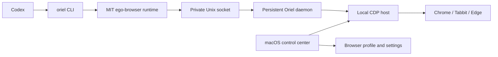

# Oriel

**AI 浏览器协作台。让 Codex 使用你选择的 Chromium 浏览器。**

Oriel packages the MIT-licensed `ego-browser` runtime with a lightweight
macOS control center. It detects Chrome, Tabbit, and Edge, launches a managed
browser with a persistent local profile, and installs the Codex skill and CLI
without requiring terminal setup or a separate AI browser.

> **Status:** `v0.2.0-alpha`. The core runtime is well tested, but the macOS app
> is an early preview and is not yet notarized.

## What works

- Native macOS control center and menu-bar status
- Automatic Chrome, Tabbit, and Edge detection
- One-click managed browser startup on a localhost-only CDP endpoint
- Persistent browser login state without copying or exporting cookies
- Persistent local daemon that reuses task spaces and pages across Codex calls
- One-click Codex CLI and skill installation
- Semantic snapshots, refs, navigation, clicks, typing, screenshots, waits, and
  task spaces from the upstream runtime
- Site notes for GitHub, Zhihu, BOSS Zhipin, and other tested workflows

Chrome and Tabbit have both passed an end-to-end packaged-runtime check.
The runtime test suite currently contains 299 passing tests, plus 13 host and
daemon protocol tests.

## How it works



The managed browser uses its own profile under:

```text
~/Library/Application Support/Oriel/
```

Log in normally inside that browser once. Chromium stores and encrypts the
login state. Oriel does not print, export, or copy cookie values.

## Build the macOS app

Requirements:

- macOS 13 or newer
- Xcode Command Line Tools
- npm

```bash
./scripts/build-macos-app.sh
```

The app is written to:

```text
build/Oriel.app
```

Build a local DMG:

```bash
./scripts/package-macos-dmg.sh
```

The build downloads a pinned official Node.js runtime, verifies its SHA-256
checksum, and bundles it in the app. End users do not need Node.js installed.

## First run

1. Open **Oriel**.
2. Select Chrome, Tabbit, or Edge.
3. Press **Start browser**.
4. Log in to any websites you want to use.
5. Press **One-click install** under Codex integration.
6. Restart Codex.

After that, Codex can run:

```bash
oriel --doctor
```

and browser tasks through the installed `oriel-browser` skill. The legacy
`zhiyou` and `ego-anywhere` commands remain available as compatibility aliases.

Inspect or stop the persistent background process:

```bash
oriel --daemon-status
oriel --daemon-stop
```

## Security model

- The debugging endpoint is bound to `127.0.0.1`.
- Daemon RPC uses a user-only Unix socket with `0600` permissions.
- While the managed browser is running, any process on the same Mac may be able
  to control it. Stop the browser from the control center when it is not needed.
- Browser credentials are not printed or committed to this repository.
- CAPTCHA and platform security challenges must be completed by the user.
- Site automation must respect platform rules. Oriel does not promise
  that bulk messaging, purchases, applications, or other consequential actions
  will pass anti-abuse systems.

## Development

Runtime tests:

```bash
cd package/ego-browser
npm test
npm run validate:site-skills
```

Host configuration tests:

```bash
node --test host-shim/*.test.mjs
```

## Roadmap

- One-button onboarding and clearer daemon diagnostics
- Signed and notarized Apple Silicon and Intel DMGs
- Automatic updates
- Optional connection to an existing browser session
- Windows packaging
- More tested site packs

## Upstream and license

This repository is derived from
[CitroLabs/ego-lite](https://github.com/citrolabs/ego-lite). Its open-source
`ego-browser` runtime is used under the MIT License. The original CitroLabs
copyright and license notice are preserved.

See [LICENSE](LICENSE) and
[THIRD_PARTY_NOTICES.md](THIRD_PARTY_NOTICES.md).
