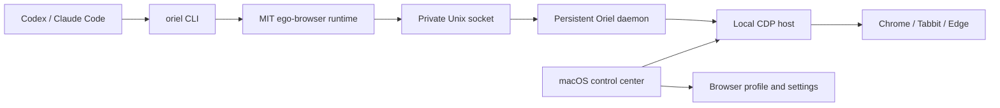

# Oriel

**AI 浏览器协作台。让 Codex 和 Claude Code 使用你选择的 Chromium 浏览器。**

Oriel packages the MIT-licensed `ego-browser` runtime with a lightweight
macOS control center. It detects Chrome, Tabbit, and Edge, launches a managed
browser with a persistent local profile, and installs the Oriel skill for
Codex and Claude Code plus a shared CLI without requiring terminal setup or a
separate AI browser.

> **Status:** `v0.2.0-alpha` Beta. The core runtime and local packaging gate are
> tested; the macOS app is not yet notarized for public distribution.

## What works

- Native macOS control center and menu-bar status
- Automatic Chrome, Tabbit, and Edge detection, including user-level
  `~/Applications` installs
- One-click managed browser startup on a verified localhost-only Chromium CDP endpoint
- Persistent browser login state without copying or exporting cookies
- Persistent local daemon that reuses task spaces and pages across agent calls
- One-click CLI and skill installation for Codex and Claude Code
- Semantic snapshots, refs, navigation, clicks, typing, screenshots, waits,
  HTML5 drag-and-drop, and task spaces from the upstream runtime
- Site notes for GitHub, Zhihu, BOSS Zhipin, and other tested workflows

The packaged Oriel runtime has an end-to-end check that starts an isolated
temporary Chrome profile, opens a page, and proves two independent CLI calls
reuse the same task and page before reading semantic snapshots. Chrome and
Tabbit have also been manually exercised through the macOS control center.
The runtime test suite currently contains 303 passing tests, plus 28 host and
daemon protocol tests.

## How it works



The complete ownership map and dependency rules are documented in
[`docs/ARCHITECTURE.md`](docs/ARCHITECTURE.md).

The managed browser uses its own profile under:

```text
~/Library/Application Support/Oriel/
```

Log in normally inside that browser once. Chromium stores and encrypts the
login state. Oriel does not print, export, or copy cookie values.

## Build the macOS app

Requirements:

- macOS 13 or newer
- Xcode Command Line Tools
- npm

```bash
./scripts/build-macos-app.sh
```

The app is written to:

```text
build/Oriel.app
```

Build a local DMG:

```bash
./scripts/package-macos-dmg.sh
```

The build downloads a pinned official Node.js runtime, verifies its SHA-256
checksum, and bundles it in the app. End users do not need Node.js installed.

## Opening a distributed DMG on macOS

**This build is not yet Developer ID signed or notarized.** The current DMG is
ad-hoc signed for local integrity checks only, and macOS Gatekeeper rejects it
on a normal first launch. This is a known Beta limitation, not an install error.

For a copy you obtained from the DMG, the actual first-open flow is:

1. Drag `Oriel.app` to `Applications` and double-click it once.
2. macOS shows a security warning such as “Apple cannot check this app for
   malicious software” or that the developer cannot be verified. The exact
   words follow your macOS language and version. Choose **Done** or **Cancel**;
   it does not open at this point.
3. Open **System Settings -> Privacy & Security**, scroll to **Security**, and
   choose **Open Anyway** for Oriel. This option normally remains for about an
   hour after the blocked launch.
4. Confirm **Open** in the second warning. macOS may ask for the current
   macOS account password before it opens.

That is three confirmations after the first double-click: dismiss the blocked
launch, **Open Anyway**, then **Open** (plus a password when macOS asks). After
that, macOS records the exception and later double-clicks open normally. Do not
override this warning unless the DMG came from a source you trust. Apple’s
current guidance is [here](https://support.apple.com/en-us/102445).

## First run after Oriel opens

1. Open **Oriel**.
2. Select Chrome, Tabbit, or Edge.
3. Press **Start browser**.
4. Log in to any websites you want to use.
5. Press **One-click install** under Agent integration.
6. Restart Codex and Claude Code.

After that, Codex can run:

```bash
oriel --doctor
```

and browser tasks through the installed `oriel-browser` skill. Oriel installs
that skill into both `~/.codex/skills/` and `~/.claude/skills/`. At the
agent-facing level it **replaces** the old `ego-browser` and `zhiyou-browser`
skills. The installer removes old copies from both locations and installs a
small `ego-browser` compatibility entry that uses only Oriel's current API.
This also safely shadows the bundled skill from an older ego lite App without
modifying that signed App. It is a redirect, not a second browser capability.
The repository still contains `skills/ego-browser` only as upstream runtime
knowledge and site notes. The legacy `zhiyou` command remains as a compatibility
alias.

### Default tab isolation

Named task spaces are recommended for every independent goal. If an agent
forgets to create one, Oriel automatically selects a persistent
`oriel-default` space. A normal space only sees and closes tabs that Oriel
created for that space; it does not enumerate, reuse, or close the tabs the user
already had open.

The task-space page also keeps a local, metadata-only lifecycle record: the
execution policy, one-action approvals, hand-off/resume events, safe failures,
and recovery requests. `Read-only` and `Draft` block browser-changing actions;
`Requires approval` blocks each such action until the user approves the next
one. This authorization is independent of task-space ownership: an agent-owned
space is not automatically authorized to make a browser change. Policy changes,
approvals, recovery, and audit history are control-plane actions owned by the
Oriel app; they are deliberately absent from the agent-facing `taskSpaces` API,
so an agent cannot approve its own blocked action through the supported facade.

Normal spaces share the selected Oriel browser profile, so they can reuse its
website sign-ins. This is tab isolation, **not** login or credential isolation.
Use a distinct Oriel browser profile lane for each account that must remain
separate. An explicit temporary isolated browser context is available for clean
one-off work, but it does not inherit the persistent profile's login state.

Inspect or stop the persistent background process:

```bash
oriel --daemon-status
oriel --daemon-stop
```

For the full first-run, privacy, status, and troubleshooting guide, read
[`docs/BETA_GUIDE.md`](docs/BETA_GUIDE.md).

## Security model

- The debugging endpoint is bound to `127.0.0.1`; Oriel verifies its Chromium
  DevTools response and loopback WebSocket before connecting or stopping it.
- Daemon RPC uses a user-only Unix socket with `0600` permissions.
- While the managed browser is running, any process on the same Mac may be able
  to control it. Stop the browser from the control center when it is not needed.
- Browser credentials are not printed or committed to this repository.
- CAPTCHA and platform security challenges must be completed by the user.
- Site automation must respect platform rules. Oriel does not promise
  that bulk messaging, purchases, applications, or other consequential actions
  will pass anti-abuse systems.

## Development

Runtime tests:

```bash
cd package/ego-browser
npm test
npm run validate:site-skills
```

Host configuration tests:

```bash
node --test host-shim/*.test.mjs
```

Run the complete local Beta verification before sharing a DMG:

```bash
./scripts/verify-beta.sh
```

The verification script checks the build, packaged Oriel browser workflow,
app signature, embedded resources, DMG contents, tests, and public-release
safety guard. It does not claim Apple Developer signing or notarization.

The true clean-account acceptance record, including what remains blocked until
an administrator creates a new macOS user, is in
[`docs/CLEAN_ENVIRONMENT_ACCEPTANCE.md`](docs/CLEAN_ENVIRONMENT_ACCEPTANCE.md).

## Roadmap

- One-button onboarding and clearer daemon diagnostics
- Signed and notarized Apple Silicon and Intel DMGs
- Automatic updates
- Optional connection to an existing browser session
- Windows packaging
- More tested site packs

## Upstream and license

This repository is derived from
[CitroLabs/ego-lite](https://github.com/citrolabs/ego-lite). Its open-source
`ego-browser` runtime is used under the MIT License. The original CitroLabs
copyright and license notice are preserved.

See [LICENSE](LICENSE) and
[THIRD_PARTY_NOTICES.md](THIRD_PARTY_NOTICES.md).
