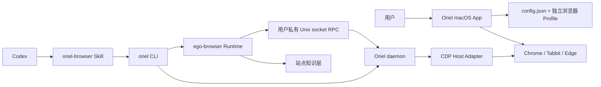

# Oriel 功能架构

本文按产品功能说明 Oriel 的代码归属、运行链路和依赖边界。目标是让后续开发先找到正确模块，再开始修改代码。

## 1. 产品分层

| 层 | 产品职责 | 代码位置 |
| --- | --- | --- |
| macOS 产品层 | 首次欢迎、浏览器选择、启动/停止、Codex 安装、状态诊断 | `apps/macos/Sources/` |
| 本机接入层 | CLI、持久 daemon、Unix socket RPC、Chromium CDP 适配 | `host-shim/` |
| Agent 运行时 | 会话、页面、语义快照、定位器、输入、等待、下载、录屏 | `package/ego-browser/src/` |
| 站点知识层 | 站点说明、稳定选择器和可复用工具 | `skills/ego-browser/learnings/` |
| Agent 使用入口 | 告诉 Codex 何时以及怎样调用 Oriel | `skills/oriel-browser/`、`skills/ego-browser/` |
| 构建发布层 | Swift 编译、Node 运行时打包、图标、字体、DMG | `scripts/`、`assets/` |

## 2. 运行链路



macOS App 负责配置和生命周期，不执行 Agent 操作。Agent 操作统一从 CLI 进入，由 daemon 保持浏览器会话和页面状态，再由运行时提供语义化能力。

## 3. macOS 产品层

```text
apps/macos/
├── Resources/
│   ├── en.lproj/Localizable.strings
│   └── zh-Hans.lproj/Localizable.strings
└── Sources/
    ├── App/
    │   └── OrielApp.swift
    ├── Core/
    │   ├── AppModel.swift
    │   ├── Domain.swift
    │   └── Localization.swift
    ├── Features/
    │   ├── BrowserControl/
    │   │   └── AppModel+BrowserControl.swift
    │   ├── CodexIntegration/
    │   │   └── AppModel+CodexIntegration.swift
    │   ├── ControlCenter/
    │   │   └── ControlCenterView.swift
    │   ├── Diagnostics/
    │   │   └── AppModel+Diagnostics.swift
    │   └── Onboarding/
    │       ├── GridScanField.swift
    │       └── WelcomeView.swift
    └── Shared/
        └── StatusComponents.swift
```

### App

`OrielApp.swift` 只负责应用启动、欢迎页与控制中心切换、菜单栏入口。这里不放浏览器控制或安装逻辑。

### Core

`Domain.swift` 定义品牌常量、浏览器选项和持久化配置结构。

`AppModel.swift` 是 SwiftUI 的单一产品状态源，保存连接状态、安装状态、忙碌状态和用户可见消息。它也负责读取与保存基础配置。

`Localization.swift` 是界面文案的统一入口。用户可见文案使用语义 key，并由英文和简体中文资源提供具体内容。

### Features

`BrowserControl` 管理受控 Chromium 的独立 Profile、调试端口、启动和停止。

`CodexIntegration` 安装 CLI 启动器和 Codex Skill，不负责执行浏览器任务。

`Diagnostics` 汇总浏览器、CLI 和 Skill 的健康状态。

`ControlCenter` 只渲染产品控制台，并把用户操作转交给 `AppModel`。

`Onboarding` 只负责欢迎体验。GridScan 动画与欢迎页布局分离，避免视觉迭代影响应用入口。

### Shared

`Shared` 只存放多个界面会复用的轻量组件。带业务状态或业务动作的组件应留在对应 Feature。

## 4. 本机接入层

| 文件 | 责任 |
| --- | --- |
| `oriel.mjs` | CLI 入口；连接或拉起 daemon，并把 stdin 脚本交给运行时 |
| `oriel-daemon.mjs` | 单实例后台进程；管理锁、退出和 CDP Host 生命周期 |
| `daemon-rpc.mjs` | 用户私有 Unix socket 协议、消息路由和方法白名单 |
| `stock-chrome-host.mjs` | 把 Chromium CDP 转成运行时需要的 `ego` Host 接口 |
| `runtime-config.mjs` | 读取并校验 Oriel 本地配置，只允许 localhost 调试端点 |

本层不包含 Agent 业务语义。它只负责可靠地把运行时连接到浏览器。

## 5. Agent 运行时

```text
package/ego-browser/src/
├── index.ts / run.ts / helpers.ts
├── browser-runtime.ts / state.ts
├── cdp-eval.ts
├── element-resolver.ts / locator-query.ts
├── ref-map.ts / ref-state.ts
├── driver/
└── learning/
```

`index.ts` 是 SDK 与 CLI 的公共入口。`helpers.ts` 是 Agent 可调用 API 的单一来源。

`browser-runtime.ts` 管理 CDP 会话、事件和重连；`state.ts` 保存每个进程内共享的运行时状态。

`element-resolver.ts` 与 `locator-query.ts` 负责把 ref、role、CSS、XPath 等目标解析成真实元素。

`driver/` 按能力拆分导航、观察、定位器、鼠标、键盘、等待、文件、下载和录屏。浏览器操作实现必须留在这里。

`learning/` 只负责发现、校验和执行站点知识，不直接实现底层点击与输入。

## 6. 站点知识层

每个站点包位于 `skills/ego-browser/learnings/<site>/`，由以下内容组成：

```text
manifest.json
notes/
tools/
browser-tools/
```

站点知识应记录稳定 URL、稳定选择器、平台限制和已验证流程。不得保存账号、Cookie、密码、验证码或其他秘密。

## 7. 本地数据

Oriel 的持久数据位于：

```text
~/Library/Application Support/Oriel/
├── config.json
├── daemon.lock
├── daemon.sock
└── Profiles/
    ├── chrome/
    ├── tabbit/
    └── edge/
```

登录态由 Chromium 写入独立 Profile。Oriel 不复制或导出 Cookie 值。daemon socket 与锁文件仅对当前用户开放。

## 8. 多语言

用户可见文案不能直接写在 Swift 代码中。统一通过 `L10n.text("功能.语义")` 或 `L10n.format(...)` 读取。

当前语言：

- `en.lproj`：英文，也是开发默认语言。
- `zh-Hans.lproj`：简体中文。

`scripts/check-architecture.sh` 会校验两种语言的 key 完全一致，并检查 Swift 使用的 key 都已声明。

## 9. 依赖规则

1. `App` 可以依赖 `Core`、`Features` 和 `Shared`。
2. `Features` 可以依赖 `Core` 和 `Shared`，Feature 之间不直接共享内部实现。
3. `Core` 不依赖具体 View。
4. `Shared` 不包含浏览器启动、文件安装或网络连接等业务动作。
5. `host-shim` 可以依赖构建后的 Agent runtime；Agent runtime 不反向依赖 Oriel App。
6. `learning` 只能通过公开 helper/driver 能力工作，不绕过运行时直接接触 daemon。
7. 浏览器自动化实现统一放在 `package/ego-browser/src/driver/`。

## 10. 验证矩阵

| 改动范围 | 最低验证 |
| --- | --- |
| 目录边界、多语言 key | `./scripts/check-architecture.sh` |
| SwiftUI、AppModel、macOS 资源 | `./scripts/build-macos-app.sh`，打开 App 检查欢迎页和控制中心 |
| host-shim、daemon、配置 | `node --test host-shim/*.test.mjs` |
| Agent runtime、driver、locator | 在 `package/ego-browser/` 运行 `npm test` |
| 站点知识 | `npm run validate:site-skills` |
| 发布包 | `./scripts/package-macos-dmg.sh`、`codesign --verify`、`hdiutil verify` |

## 11. 新功能放置原则

新增用户可见流程时，在 `Features/<FeatureName>/` 建立独立目录。

新增浏览器动作时，进入 `package/ego-browser/src/driver/`，并通过 `helpers.ts` 暴露。

新增站点经验时，只增加 learning 包，不修改通用 driver 来硬编码站点行为。

新增本地通信能力时，先扩展 `daemon-rpc.mjs` 的显式白名单和测试，再实现 Host 方法。
